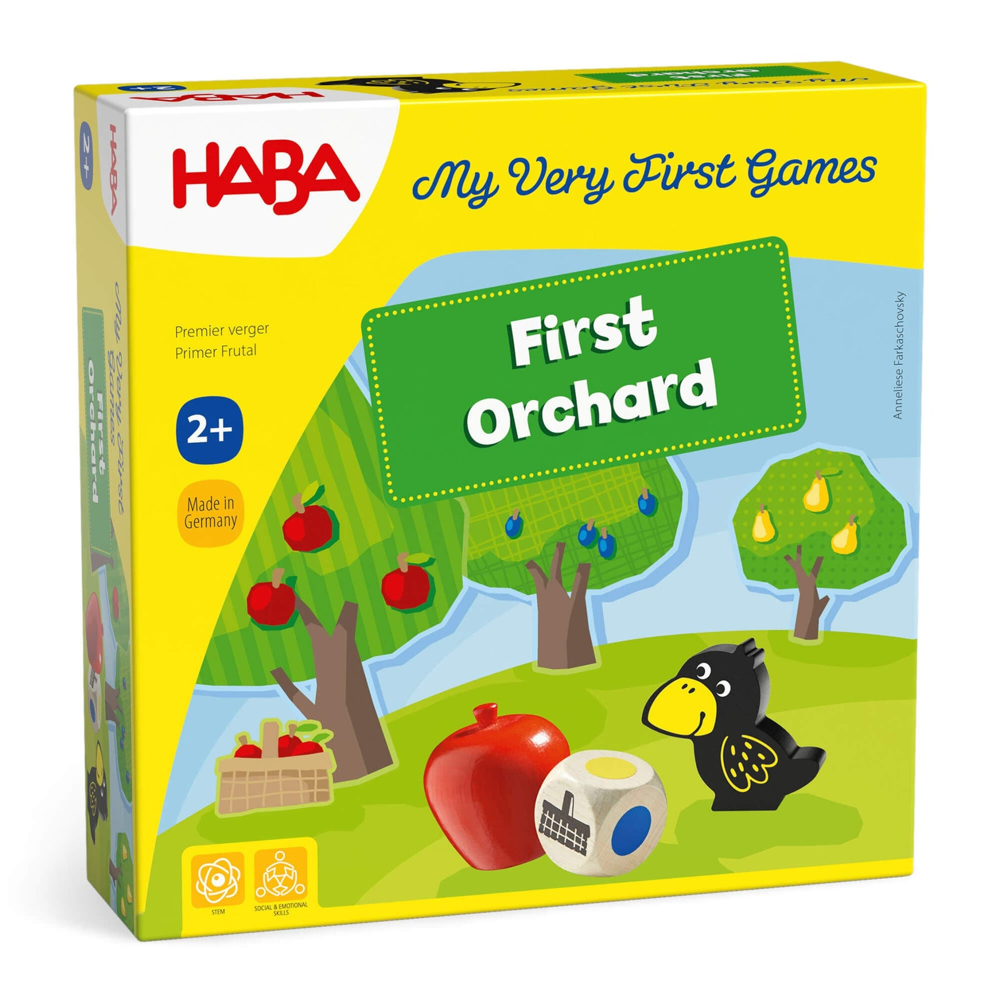

The [First Orchard](https://www.habausa.com/products/my-very-first-games-first-orchard) board game by Haba is a fun and easy toddler boardgame that is engaging and specifically designed for the little ones!

It was the first board game that my own child played. What sets this game apart is the cooperative nature of the game. All the players are helping each other collect the different fruits before the raven can reach the orchard.

Since it's a fairly easy game, I thought it would be a fun exercise to code (in Python) a text-based version of this incredibly fun board game. Unlike the board game, this version is for one-player only.

If you're learning to code in Python, I think this is also a fun exercise to learn how a simple board game can be coded in Python. I know that many of my students have found this to be useful.

### Disclaimer

The code is not copyright protected. You can use it as you wish. Please note that the First Orchard game is the property and trademark of Haba. Haba has nothing to do with this code in any way. This code is just a simple fun exercise and a great learning experience.

### Creating the Environment
I used micromamba to create the environment behind this game. It's not really needed, but it is helpful to create an environment that will not impact base Python on your machine. The only library I used in this code is the `random` library. I'm also coding this in python 3.13. See the [env.yaml](https://github.com/nikdata/first-orchard-game-python/blob/main/env.yaml) for more information.

To create the environment:

```shell
micromamba create -f env.yaml
```

To activate the environment:

```shell
micromamba activate firstorchard
```

To run the game:

```shell
python game-script.py
```

### About the Code

I've added numerous comments throughout the code (see [game-script.py](https://github.com/nikdata/first-orchard-game-python/blob/main/game-script.py)). This is not a script structured with object-oriented principles. I've used a functional-programming approach for this exercise. Put another way, I'm not using classes or objects. I'm primarily using functions.

For each function, I've also used [typing](https://docs.python.org/3/library/typing.html) hints (these are not enforced). This approach helps to highlight what kinds of values are accepted by functions and what kind of value will be returned by the function (if any). 